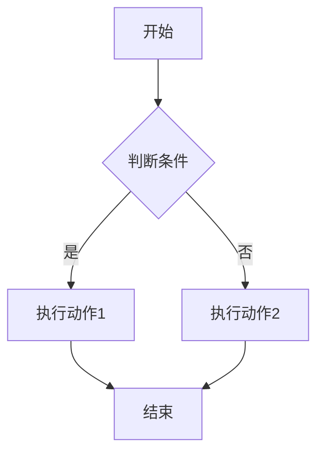
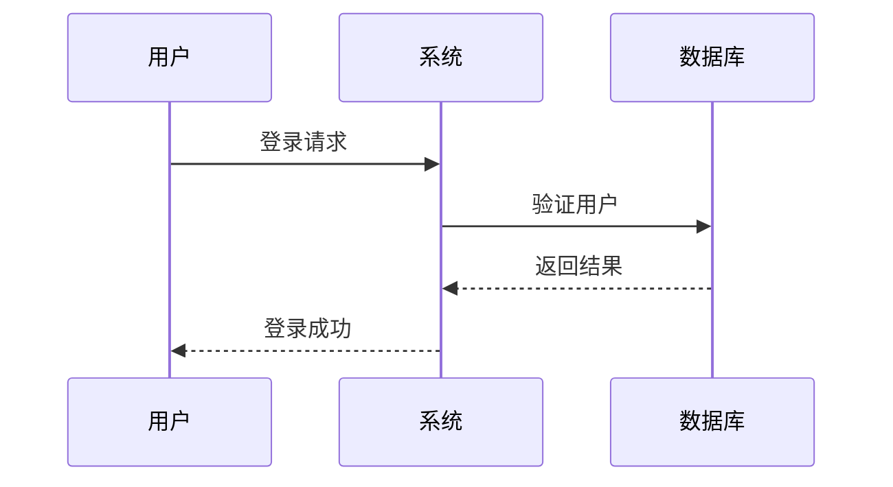
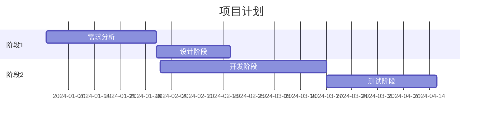
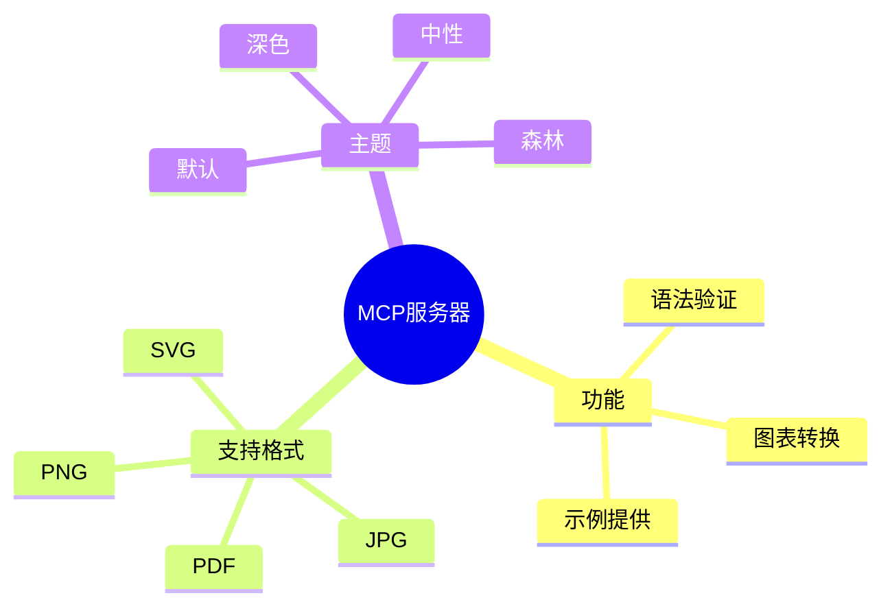

# MCP Mermaid Server 使用指南

## 快速开始

### 1. 部署服务器

```bash
# 运行部署脚本
./deploy.sh

# 或手动安装
uv sync
```

### 2. 启动服务器

#### STDIO 模式（推荐用于桌面客户端）
```bash
uv run python main.py
```

#### SSE 模式（推荐用于 Web 服务）
```bash
uv run python main_sse.py
```

## 客户端配置

### Cherry Studio 配置

1. 打开 Cherry Studio
2. 进入设置 → MCP 服务器
3. 添加新服务器：
   - **类型**: STDIO
   - **命令**: `uv`
   - **参数**: 
     ```
     --directory
     /path/to/mermaid_mcp_server
     run
     python
     main.py
     ```

### Dify 配置

1. 在 Dify 中添加 MCP 连接
2. 选择 SSE 模式
3. 输入服务器地址: `http://localhost:8003/sse`

### Cursor/Cline 配置

在 `.cursorrules` 或配置文件中添加：
```json
{
  "mcp": {
    "servers": {
      "mermaid": {
        "command": "uv",
        "args": ["--directory", "/path/to/mermaid_mcp_server", "run", "python", "main.py"]
      }
    }
  }
}
```

## 使用示例

### 基本流程图



**MCP 调用示例:**
```python
result = convert_mermaid_to_image(
    mermaid_code="""
    flowchart TD
        A[开始] --> B{判断条件}
        B -->|是| C[执行动作1]
        B -->|否| D[执行动作2]
        C --> E[结束]
        D --> E
    """,
    output_format="png",
    theme="dark",
    width=800,
    height=600
)
```

### 序列图



### 甘特图



### 思维导图



## 高级用法

### 自定义主题和样式

```python
# 深色主题 + 自定义背景色
result = convert_mermaid_to_image(
    mermaid_code="flowchart TD\n    A --> B",
    output_format="png",
    theme="dark",
    background_color="1a1a1a",  # 深灰色背景
    width=1200,
    height=800
)
```

### 批量转换

```python
diagrams = [
    ("flowchart", "flowchart TD\n    A --> B --> C"),
    ("sequence", "sequenceDiagram\n    A->>B: Hello"),
    ("pie", "pie\n    \"A\" : 40\n    \"B\" : 60")
]

for name, code in diagrams:
    result = convert_mermaid_to_image(
        mermaid_code=code,
        output_format="svg",  # SVG 适合批量处理
        theme="neutral"
    )
    # 处理结果...
```

### 语法验证工作流

```python
# 先验证语法
validation = validate_mermaid_syntax(mermaid_code)

if validation["valid"]:
    # 语法正确，进行转换
    result = convert_mermaid_to_image(
        mermaid_code=mermaid_code,
        output_format="png"
    )
else:
    print(f"语法错误: {validation['error']}")
```

## 故障排除

### 常见问题

#### 1. 连接超时
**问题**: "Conversion timeout"
**解决**: 
- 检查网络连接
- 简化复杂图表
- 增加超时时间

#### 2. 语法错误
**问题**: "Invalid Mermaid syntax"
**解决**:
- 使用 `validate_mermaid_syntax` 工具检查
- 参考 [Mermaid 官方文档](https://mermaid.js.org/)
- 使用 `mermaid://examples/{type}` 资源获取示例

#### 3. 图表过大
**问题**: "Diagram too large for API"
**解决**:
- 减少节点数量
- 分割为多个小图表
- 使用更简洁的标签

#### 4. 服务器无法启动
**问题**: 端口被占用或依赖缺失
**解决**:
```bash
# 检查端口占用
lsof -i :8003

# 重新安装依赖
uv sync --reinstall

# 使用不同端口
export PORT=8004
uv run python main.py
```

### 调试模式

启用详细日志：
```bash
export LOG_LEVEL=DEBUG
uv run python main.py
```

### 性能优化

1. **使用 SVG 格式**进行快速预览
2. **批量处理**时使用相同主题减少缓存未命中
3. **合理设置图像尺寸**避免过大文件

## API 参考

### 工具列表

| 工具名称 | 描述 | 参数 |
|---------|------|------|
| `convert_mermaid_to_image` | 转换 Mermaid 代码为图像 | mermaid_code, output_format, theme, background_color, width, height |
| `validate_mermaid_syntax` | 验证 Mermaid 语法 | mermaid_code |

### 资源列表

| 资源 URI | 描述 |
|----------|------|
| `mermaid://examples/flowchart` | 流程图示例 |
| `mermaid://examples/sequence` | 序列图示例 |
| `mermaid://examples/gantt` | 甘特图示例 |
| `mermaid://examples/pie` | 饼图示例 |
| `mermaid://examples/gitgraph` | Git 图示例 |
| `mermaid://examples/mindmap` | 思维导图示例 |
| `mermaid://examples/class` | 类图示例 |

### 支持的格式

- **PNG**: 通用位图格式，适合大多数用途
- **JPG**: 压缩位图格式，文件较小
- **SVG**: 矢量格式，可无限缩放
- **PDF**: 文档格式，适合打印和分享

### 支持的主题

- **default**: 标准蓝色主题
- **dark**: 深色主题，适合暗色界面
- **neutral**: 中性灰色主题
- **forest**: 绿色主题，自然风格

## 扩展开发

### 添加新工具

```python
@mcp.tool()
def my_custom_tool(param1: str, param2: int) -> dict:
    """自定义工具描述"""
    # 实现逻辑
    return {"result": "success"}
```

### 添加新资源

```python
@mcp.resource("myresource://{param}")
def my_custom_resource(param: str) -> str:
    """自定义资源描述"""
    return f"Resource content for {param}"
```

### 自定义配置

创建 `config.py`:
```python
import os

class Config:
    HOST = os.getenv("HOST", "0.0.0.0")
    PORT = int(os.getenv("PORT", 8003))
    TIMEOUT = int(os.getenv("TIMEOUT", 30))
    LOG_LEVEL = os.getenv("LOG_LEVEL", "INFO")
```

## 许可证

本项目基于 MIT 许可证开源。详见 LICENSE 文件。